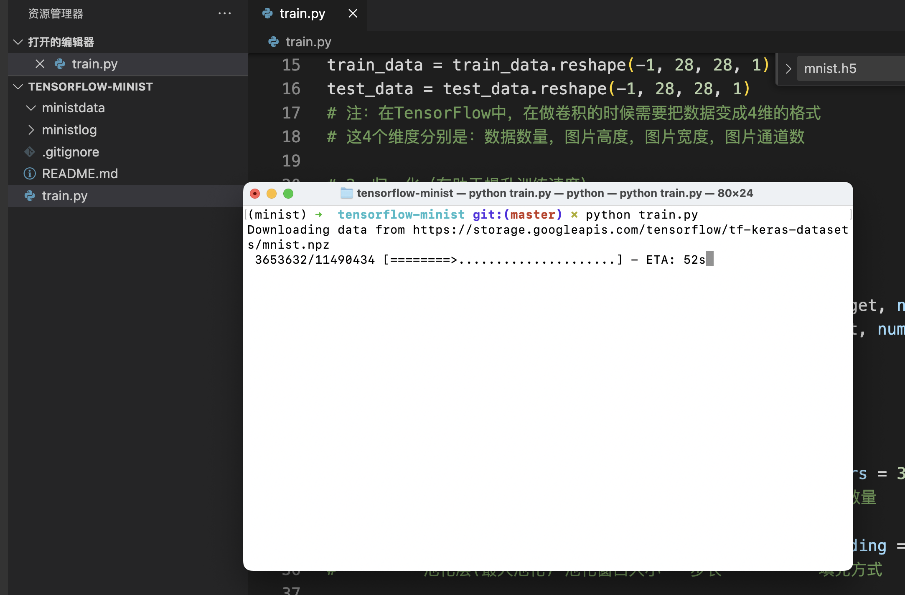
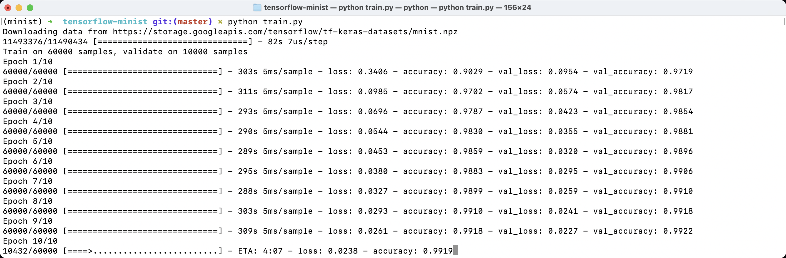
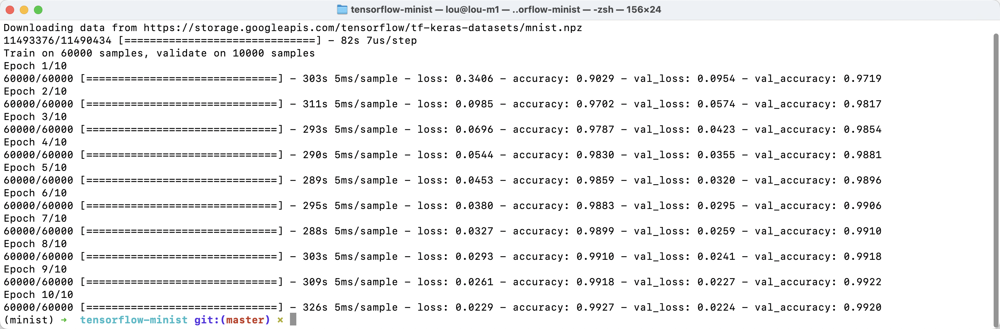
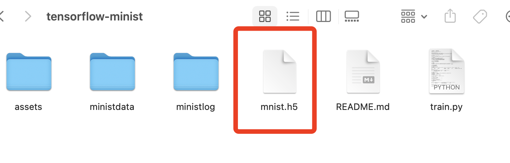

# tensorflow手写数字识别

执行`python train.py`代码，训练模型。



# 一、训练模型

## 1、载入训练数据

tensorflow框架内置了很多样本数据集，我们可以直接拿来使用。

```python
# 1、载入数据
mnist = tf.keras.datasets.mnist
(train_data, train_target), (test_data, test_target) = mnist.load_data()
```

MNIST数据集是由0〜9手写数字图片和数字标签所组成的，由60,000个训练样本和10,000个测试样本组成，每个样本都是一张`28*28`像素的灰度手写数字图片。

如下图所示。


## 2、改变数据维度

> 在TensorFlow中，在做卷积的时候需要把数据变成4维的格式。这4个维度分别是：
>
> - 数据数量：如果不知道，可以用-1表示
> - 图片高度：28像素
> - 图片宽度：28像素
> - 图片通道数：1（RGB是3通道，黑白图片是1通道）

```python
# 2、改变数据维度
train_data = train_data.reshape(-1, 28, 28, 1)
test_data = test_data.reshape(-1, 28, 28, 1)
```

## 3、归一化处理（normalization）

归一化的好处是，对于异常样本数据，能够有效对特征进行处理。

比如，有一个二手奢侈品包包，我们要想评估它的二手价格，有这样两个维度：

- 成色：85、90、95、99（二手包只有这四个成色）
- 新品价格：5,000~100,000之间不等

| 包包 | 成色 | 新品价格 | 二手价格 |
| ---- | ---- | -------- | -------- |
| 包1  | 99   | 100,000  | 92,000   |
| 包2  | 95   | 95,000   | 92,000   |
| 包3  | 95   | 5,000    | 4,500    |
| 包4  | 85   | 5,000    | 4,000    |
| 包5  | 85   | 100,000  | 80,000   |

从这个表中，能看出，哪个对二手价格的影响（权重）更大呢？

很明显，是新品价格和二手价格更接近。

但是，实际上，是成色对二手价格的影响更大。

所以，我们需要把成色和新品价格都归一到[0，1]区间内，这样就能够看出谁的权重大了。

这种处理方法在很多场景都有运用。比如：

- 二手房价格（房间数量、房间面积）
- 健康指标（血液中某些含量0.1%，有些含量是1%）
- 信用评分数据（收入、借款金额）
- ......

## 4、独热编码

```python
# 4、独热编码
train_target = tf.keras.utils.to_categorical(train_target, num_classes=10)
test_target = tf.keras.utils.to_categorical(test_target, num_classes=10)    #10种结果
```

## 5、搭建卷积神经网络

1. 第一层：卷积层+池化层
2. 第二层：卷积层+池化层
3. 扁平化处理
4. 第三层：第一个全连接层
5. 第四层：第二个全连接层（输出层）

## 6、编译

设置优化器、损失函数、标签。 

## 7、训练模型

把数据放入卷积神经网络中进行训练。

## 8、保存模型

得到训练后的模型并保存，`model.save('mnist.h5')`。



# 二、使用模型识别数字



模型训练完毕，耗时50分钟，我们得到了一个`mnist.h5`手写数字识别的模型。



接下来，我们就可以用这个模型来识别一些图片啦。

