# tensorflow 手写数字识别

执行`python train.py`代码，训练模型。


# 一、训练模型

## 1、载入训练数据

tensorflow 框架内置了很多样本数据集，我们可以直接拿来使用。

```python
# 1、载入数据
mnist = tf.keras.datasets.mnist
(train_data, train_target), (test_data, test_target) = mnist.load_data()
```

MNIST 数据集是由 0〜9 手写数字图片和数字标签所组成的，由 60,000 个训练样本和 10,000 个测试样本组成，每个样本都是一张`28*28`像素的灰度手写数字图片。

如下图所示。


## 2、改变数据维度

> 在 TensorFlow 中，在做卷积的时候需要把数据变成 4 维的格式。这 4 个维度分别是：
>
> - 数据数量：如果不知道，可以用-1 表示
> - 图片高度：28 像素
> - 图片宽度：28 像素
> - 图片通道数：1（RGB 是 3 通道，黑白图片是 1 通道）

```python
# 2、改变数据维度
train_data = train_data.reshape(-1, 28, 28, 1)
test_data = test_data.reshape(-1, 28, 28, 1)
```

## 3、归一化处理（normalization）

归一化的好处是，对于异常样本数据，能够有效对特征进行处理。

比如，有一个二手奢侈品包包，我们要想评估它的二手价格，有这样两个维度：

- 成色：85、90、95、99（二手包只有这四个成色）
- 新品价格：5,000~100,000 之间不等

| 包包 | 成色 | 新品价格 | 二手价格 |
| ---- | ---- | -------- | -------- |
| 包 1 | 99   | 100,000  | 92,000   |
| 包 2 | 95   | 95,000   | 92,000   |
| 包 3 | 95   | 5,000    | 4,500    |
| 包 4 | 85   | 5,000    | 4,000    |
| 包 5 | 85   | 100,000  | 80,000   |

从这个表中，能看出，哪个对二手价格的影响（权重）更大呢？

很明显，是新品价格和二手价格更接近。

但是，实际上，是成色对二手价格的影响更大。

所以，我们需要把成色和新品价格都归一到[0，1]区间内，这样就能够看出谁的权重大了。

这种处理方法在很多场景都有运用。比如：

- 二手房价格（房间数量、房间面积）
- 健康指标（血液中某些含量 0.1%，有些含量是 1%）
- 信用评分数据（收入、借款金额）
- ......

## 4、独热编码

```python
# 4、独热编码
train_target = tf.keras.utils.to_categorical(train_target, num_classes=10)
test_target = tf.keras.utils.to_categorical(test_target, num_classes=10)    #10种结果
```

## 5、搭建卷积神经网络

1. 第一层：卷积层+池化层
2. 第二层：卷积层+池化层
3. 扁平化处理
4. 第三层：第一个全连接层
5. 第四层：第二个全连接层（输出层）

## 6、编译

设置优化器、损失函数、标签。

## 7、训练模型

把数据放入卷积神经网络中进行训练。

## 8、保存模型

得到训练后的模型并保存，`model.save('mnist.h5')`。


# 二、使用模型识别数字


模型训练完毕，耗时 50 分钟，我们得到了一个`mnist.h5`手写数字识别的模型。


接下来，我们就可以用这个模型来识别一些图片啦。

## 1、手写数字并裁剪

首先，我们先写几个数字，为了保证效果，我们选择了三个不同的人来写。

| 人  | 字体                                                             |
| --- | ---------------------------------------------------------------- |
| 张  | 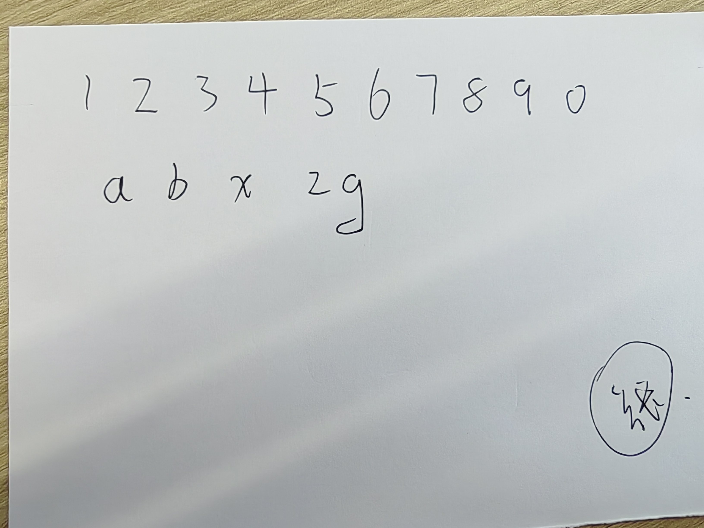 |
| 宗  | 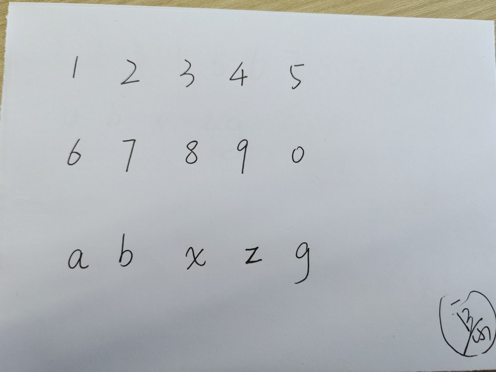   |
| 史  | 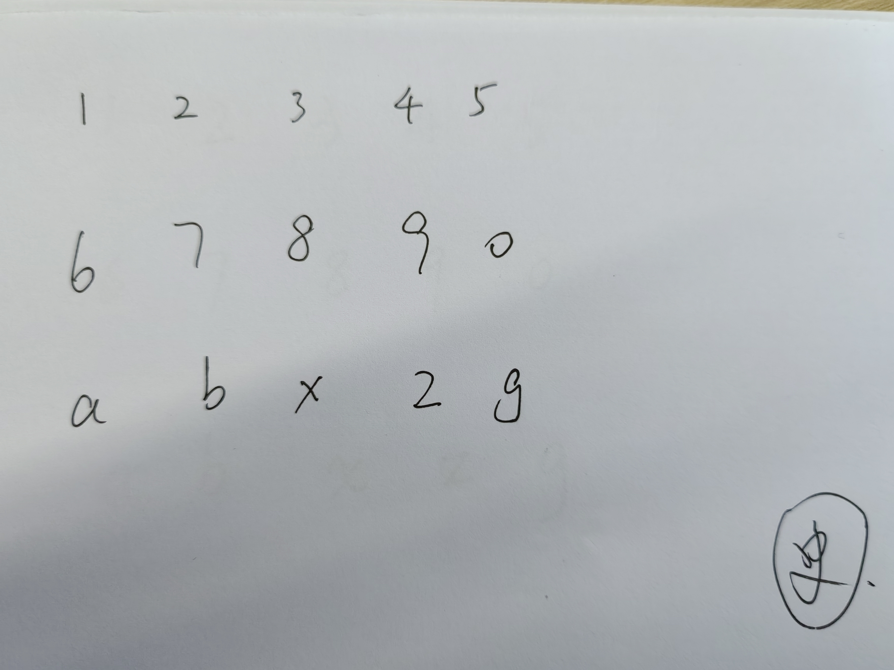     |

然后，我们把这些字给裁剪出来 。

| 人  | 0                              | 1                              | 3                              | 4                              | 5                              | 6                              | 7                              | 8                              | 9                              | 0                              | a                              | b                              | g                              | x                              | z                              |
| --- | ------------------------------ | ------------------------------ | ------------------------------ | ------------------------------ | ------------------------------ | ------------------------------ | ------------------------------ | ------------------------------ | ------------------------------ | ------------------------------ | ------------------------------ | ------------------------------ | ------------------------------ | ------------------------------ | ------------------------------ |
| 张  | 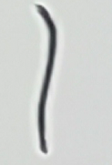 | 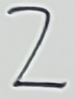 | 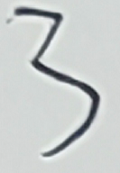 | 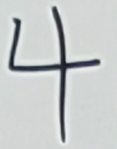 | 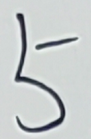 | 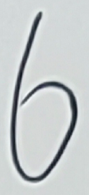 | 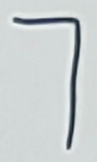 |  | 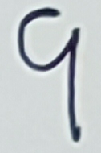 | 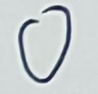 |  | 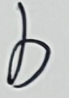 | 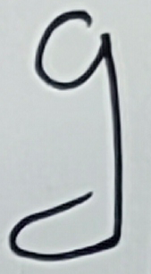 | 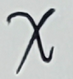 | 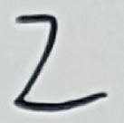 |
| 宗  | 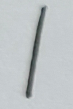   | 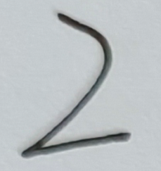   |    | 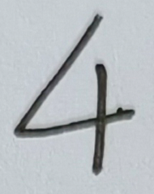   | 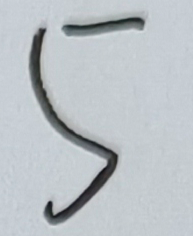   | 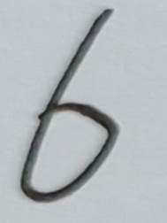   | 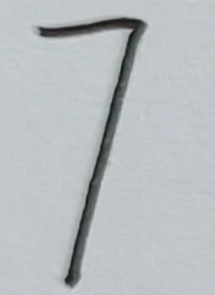   | 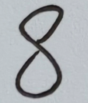   | 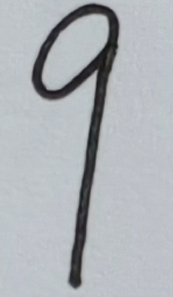   | 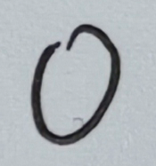   | 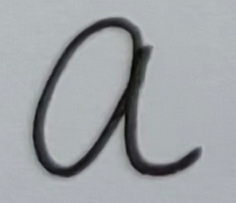   | 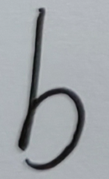   | 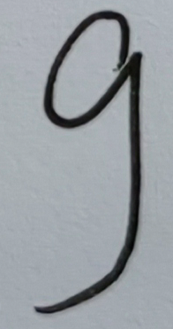   | 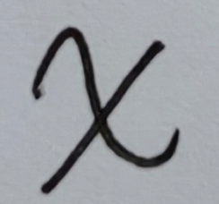   | 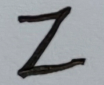   |
| 史  | 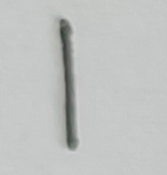     | 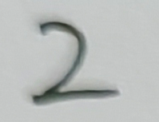     | 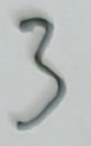     | 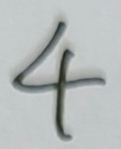     | 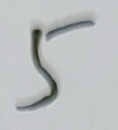     | 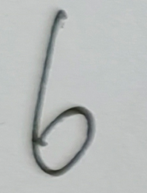     | 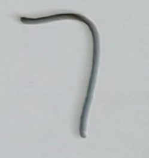     | 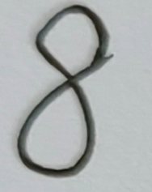     | 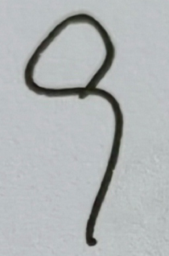     | 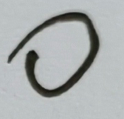     | 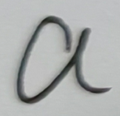     |      | 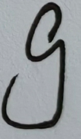     | 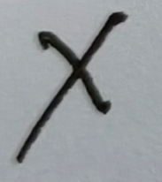     | 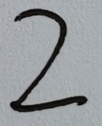     |

> **裁剪很重要！**因为如果不裁剪，图片在缩小到`28*28`像素的图片时，数字就会缩成一个点，导致预测不精确。

## 2、载入模型

```python
mnist = tf.keras.datasets.mnist(x_train, y_train), (x_test, y_test) = mnist.load_data()
model = load_model('mnist.h5')
```

## 3、加载数字图片

然后，加载数字图片，并对图片进行处理：

1. 转灰度图
2. 转黑底白字、数据归一化
3. 转四维数据（CNN 预测需要）

```python
img = Image.open('./images/x.jpg')
img = img.resize((28, 28))
```

## 3、开始预测

我们开始使用训练的模型进行预测。

```python
prediction = model.predict(image)           # 预测
for i in range(0, 9):
  temp = prediction[0][i]
  print(i, '预测率:', int(prediction[0][i]*100), '%')

prediction = np.argmax(prediction, axis=1)   # 找出最大值
print('最终结果：', prediction)
```

然后，终端输出预测的结果如下所示：

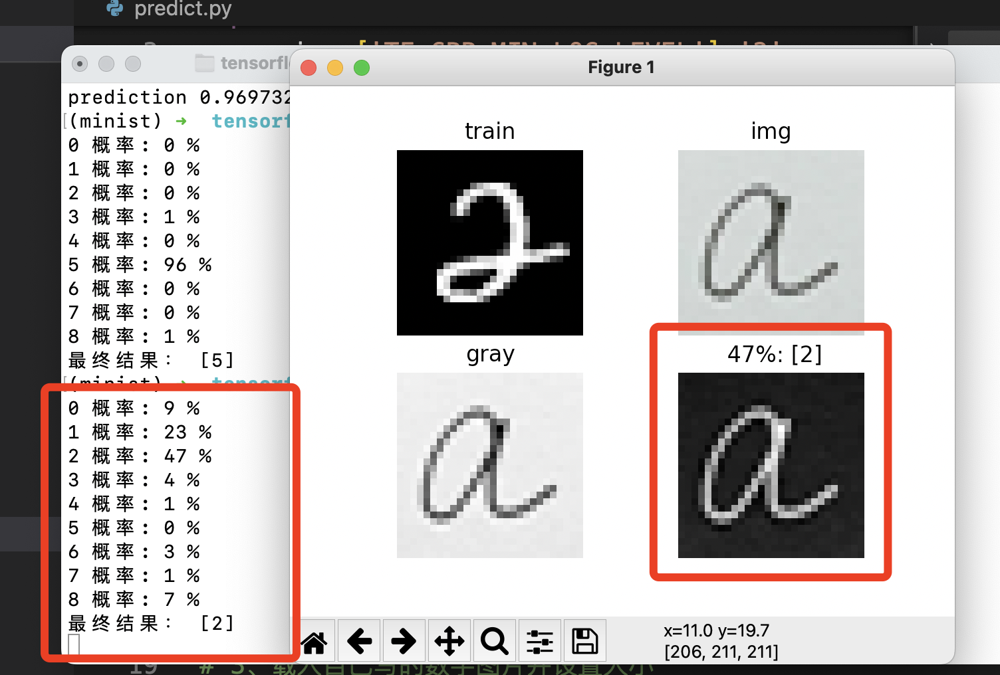

我们发现，这个图片有 47%的概率是数字 2。

然后，我们再换另一张图片，看看效果如何。

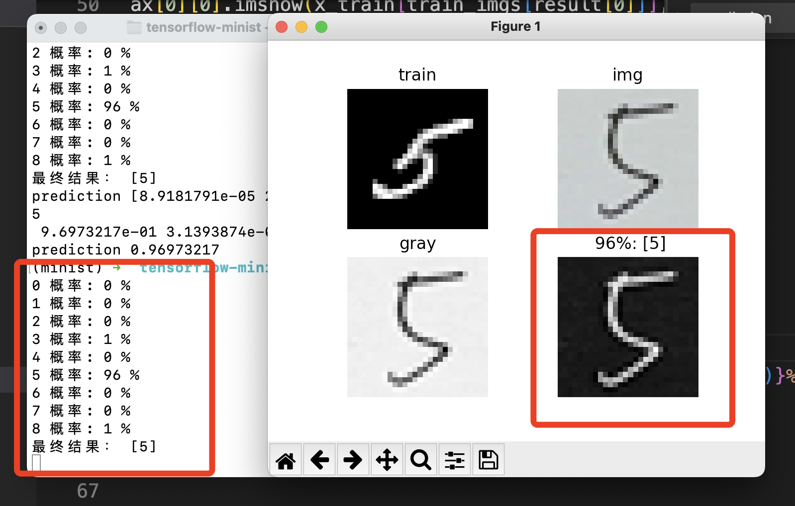
